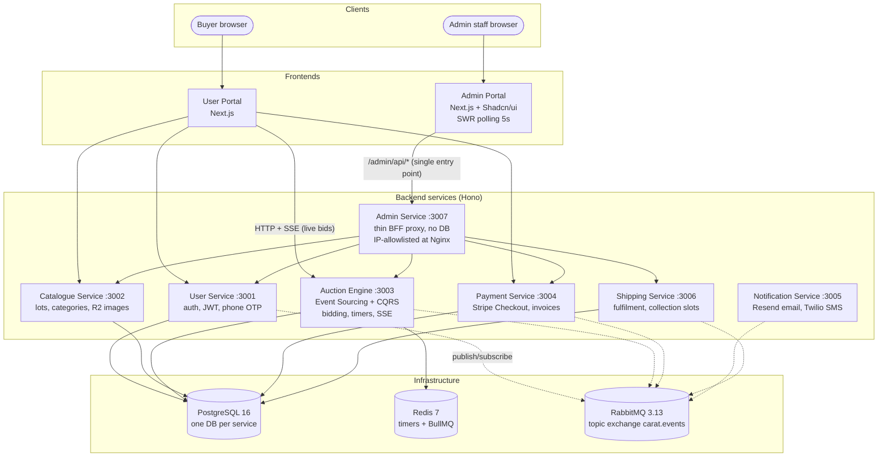
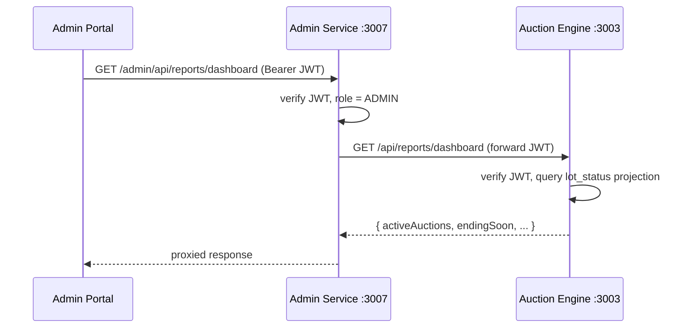

# Architecture — The Carat Room

This diagram reflects the codebase as built. It differs from the original spec
([specs/2026-06-20-architecture-design.md](superpowers/specs/2026-06-20-architecture-design.md))
in one respect: the spec proposed consolidating services (`core-service`, `fulfilment-service`),
but the implementation kept them separate.

## System Overview

## Key architectural decisions

| Decision | Detail |
|---|---|
| Admin Service as BFF | Admin Portal calls one service; the Admin Service validates the admin JWT and fans out to domain services over internal HTTP. It owns no database — all reads and mutations go through each service's API, preserving service boundary ownership. Kept separate so Nginx can IP-allowlist the whole `/admin/*` surface with one rule. |
| User Portal has no BFF | Public traffic is routed by Nginx path prefix directly to each domain service. Its few Next.js API routes exist to manage the httpOnly refresh-token cookie, not to aggregate services. |
| Event Sourcing | Auction Engine only. All other services are standard CRUD. |
| Service communication | State changes travel as RabbitMQ domain events on the `carat.events` topic exchange. No cross-service database access; no service-to-service HTTP for state mutations (the Admin Service proxies requests but each operation is a single downstream call). |
| Realtime | SSE from the Auction Engine to the lot detail page; bids submitted via HTTP POST. Admin Portal polls with SWR instead. |
| Auth | RS256 JWT issued by the User Service; every service validates independently with the shared public key (`shared-auth`). Admin routes require `role: ADMIN`. |

## Dashboard request flow (example)

