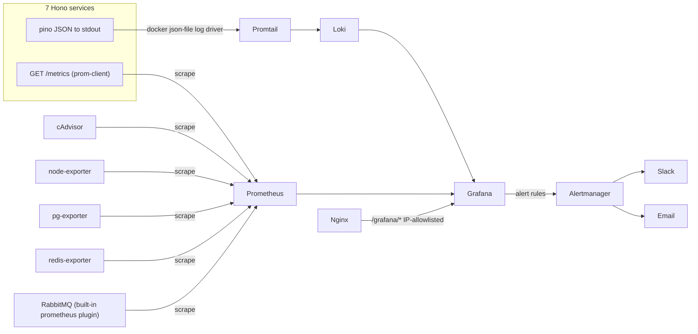

# Observability Stack (Grafana, Loki, Prometheus) — Design

**Date:** 2026-07-18
**Status:** Approved for planning

## Problem

The Carat Room has 7 backend services (`user-service`, `catalogue-service`,
`auction-engine`, `payment-service`, `notification-service`,
`shipping-service`, `admin-service`) plus 2 frontends, all deployed to a
single Hetzner VM via docker-compose. Each backend service already emits
structured JSON logs to stdout via `packages/shared-logger` (pino, with
`requestContextMiddleware` attaching `requestId`/`correlationId` and a
`logEvent`/`payload` convention). Nothing currently aggregates these logs,
exposes application metrics, or alerts on errors — diagnosing an incident
means SSHing in and grepping `docker logs` per container.

This spec covers standing up a full observability stack: log aggregation,
application + infrastructure metrics, dashboards, and alerting, so the team
has one place (Grafana) to see what's happening across all services and
gets notified when something breaks.

## Goals

- Ship every service's existing stdout logs into a searchable, labelled log
  store, with no changes to how services log today.
- Expose RED metrics (Rate, Errors, Duration) per backend service, plus
  infra-level metrics (host, containers, Postgres, Redis, RabbitMQ).
- One Grafana instance as the single pane of glass: log search, metric
  dashboards, and alert rules all in one place.
- Alert on error-rate spikes, latency regressions, and service/infra health
  issues, notifying both Slack and email.
- Run on the existing Hetzner VM via docker-compose, consistent with how
  the rest of the platform is deployed (per root `CLAUDE.md`).

## Non-goals

- Distributed tracing / APM (e.g. OpenTelemetry spans across services). Not
  in scope for this pass — logs carry `correlationId` for manual cross-service
  correlation today, which is sufficient for now.
- A dedicated exception tracker (e.g. Sentry). Error visibility is delivered
  via Loki (error-level log lines) and Prometheus (5xx rate) instead —
  covered by Grafana's own alerting, so no second vendor/SDK.
- Log shipping off the VM to a third-party host (e.g. Grafana Cloud). This
  stack is entirely self-hosted alongside the app.
- Retroactive dashboards for historical incidents — only forward-looking
  from the point this ships.

## Architecture

All new components are additional `docker-compose.yml` services on the
existing Hetzner VM, using the `profiles: [production]` pattern already
used for `nginx`, `user-portal`, etc.

### New services

| Service | Role |
|---|---|
| `loki` | Log storage/index |
| `promtail` | Reads Docker `json-file` container logs via Docker service discovery, parses pino JSON, labels by `service`/`level`/`logEvent`, pushes to Loki |
| `prometheus` | Scrapes `/metrics` from all 7 backend services + exporters |
| `cadvisor` | Per-container CPU/mem/network metrics |
| `node-exporter` | Host-level CPU/mem/disk metrics |
| `postgres-exporter` | Postgres connection/query stats |
| `redis-exporter` | Redis memory/ops stats |
| `alertmanager` | Routes Grafana alert firings to Slack + email |
| `grafana` | Dashboards, Loki + Prometheus datasources, alert rule evaluation, unified alerting UI |

RabbitMQ already ships a Prometheus plugin (`rabbitmq_prometheus`) — enabled
via its existing image config rather than a separate exporter container.

### Why Promtail over a pino→Loki push transport

Promtail reads from Docker's log driver, so shipping requires zero changes
to application code — services keep writing pino JSON to stdout exactly as
they do today. A push-based transport (e.g. `pino-loki`) would couple every
service's `shared-logger` usage to Loki's availability at request time; a
Loki blip would risk blocking or dropping application logs. Promtail
decouples log emission from log shipping.

## Application-level changes

### New package: `packages/shared-metrics`

Mirrors the existing `packages/shared-logger` package structure and
conventions (workspace package, `tsconfig` preset, `vitest` for tests).

- Wraps `prom-client`.
- Exposes `httpMetricsMiddleware(config: { service: string })`: a Hono
  middleware recording, per request:
  - `http_request_duration_seconds` (histogram), labelled `service`,
    `method`, `route`, `status`
  - `http_requests_total` (counter), labelled `service`, `method`, `route`,
    `status`
- Exposes `metricsRoute()`: a Hono handler returning the Prometheus text
  exposition format, mounted at `GET /metrics`.

### Per-service changes

Each of the 7 backend services adds `httpMetricsMiddleware` and mounts
`metricsRoute()` in its `main.ts`, alongside the existing
`requestContextMiddleware` from `shared-logger` — same composition-root
wiring pattern already in place. No business logic changes.

`shared-logger` itself is unchanged; logs already flow correctly as
structured JSON to stdout.

## Infra changes

### `docker-compose.yml`

Add the 9 services listed above, each tagged `profiles: [production]`,
each with a health check consistent with the existing style (e.g.
`wget`/`curl` against a readiness endpoint where available).

### New config files under `infra/`

- `infra/loki/loki-config.yaml` — storage backend (filesystem), compactor
  `retention_period: 720h` (30 days)
- `infra/promtail/promtail-config.yaml` — Docker service discovery config,
  pino JSON parsing stage extracting `service`, `level`, `logEvent` as labels
- `infra/prometheus/prometheus.yml` — scrape configs for all 7 services'
  `/metrics`, plus `cadvisor`, `node-exporter`, `postgres-exporter`,
  `redis-exporter`, `rabbitmq`; `--storage.tsdb.retention.time=30d`
- `infra/alertmanager/alertmanager.yml` — Slack webhook receiver + SMTP
  receiver, both wired into the default route
- `infra/grafana/provisioning/datasources/` — Loki + Prometheus datasources
  as code
- `infra/grafana/provisioning/dashboards/` — dashboard JSON committed to
  the repo (not clicked together in the UI), so dashboards are
  version-controlled and reproducible across environments

### Nginx

New `location /grafana/` block in `infra/nginx/nginx.conf`, IP-allowlisted
the same way `/admin/*` is today, proxied to the `grafana` container.

### New secrets/env vars

Added to `.env` / deploy environment (never committed):
`SLACK_WEBHOOK_URL`, `SMTP_HOST`, `SMTP_USER`, `SMTP_PASSWORD`,
`ALERT_EMAIL_TO`, `GRAFANA_ADMIN_PASSWORD`.

## Dashboards

Provisioned as JSON under `infra/grafana/provisioning/dashboards/`:

1. **Service overview** — templated by a `$service` variable: request rate,
   error rate (%), p50/p95/p99 latency (from Prometheus RED metrics)
2. **Logs explorer** — Loki panel filterable by `service`, `level`,
   `logEvent`, matching the existing `shared-logger` middleware convention
3. **Infra** — host CPU/mem/disk (node-exporter), per-container resource
   usage (cAdvisor)
4. **Data layer** — Postgres connections/query stats, Redis memory/ops,
   RabbitMQ queue depth/consumer count

## Alert rules

Grafana unified alerting, evaluated against Loki/Prometheus, routed through
Alertmanager to both Slack and email:

| Alert | Condition |
|---|---|
| High error rate | 5xx responses > 5% of requests over 5 min, per service |
| Error log spike | `level=error` log lines exceed threshold/min, per service |
| High latency | p99 request duration > 2s over 5 min, per service |
| Service down | Prometheus scrape target unreachable for 2 min |
| Queue backlog | RabbitMQ queue depth growing with no consumer activity |
| DB connection saturation | Postgres connections > 80% of configured max |

## Access & retention

- Grafana reachable only via `https://<domain>/grafana/`, IP-allowlisted at
  Nginx (same mechanism as `/admin/*`).
- Loki and Prometheus retain 30 days of data (`retention_period` /
  `--storage.tsdb.retention.time`), balancing incident-debugging window
  against disk usage on the shared app VM.

## Verification

No unit tests apply to infra config; verification is operational, run after
deploy:

1. `docker compose --profile production up -d` — confirm all new
   containers report healthy.
2. Hit each service's `/metrics` — confirm Prometheus's targets page shows
   all scrape targets as "up".
3. Generate a log line from any service — confirm it appears in Grafana's
   Loki explorer within seconds, correctly labelled by `service`/`level`.
4. Trigger a synthetic 5xx burst against one service — confirm the "High
   error rate" alert fires and both Slack and email notifications arrive.
5. Confirm `/grafana/` is reachable from an allowlisted IP and returns
   403/blocked from a non-allowlisted IP.

## Open questions / follow-ups (explicitly out of scope here)

- Distributed tracing (OpenTelemetry) — candidate for a future spec if
  cross-service correlation via `correlationId` proves insufficient.
- Dedicated exception tracker (Sentry) — revisit if Loki/Prometheus-based
  error visibility proves inadequate for triage.
